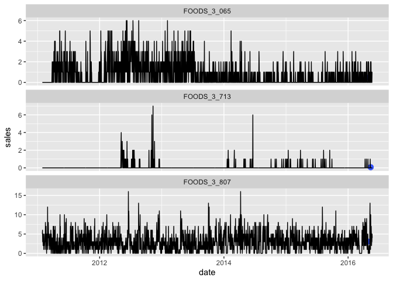

dynamic regression
================
Anh Tran
2022-12-25

``` r
knitr::opts_chunk$set(echo = TRUE)

library(fpp3)
```

    ## Registered S3 method overwritten by 'tsibble':
    ##   method               from 
    ##   as_tibble.grouped_df dplyr

    ## ── Attaching packages ──────────────────────────────────────────── fpp3 1.0.0 ──

    ## ✔ tibble      3.2.1     ✔ tsibble     1.1.5
    ## ✔ dplyr       1.1.4     ✔ tsibbledata 0.4.1
    ## ✔ tidyr       1.3.1     ✔ feasts      0.3.2
    ## ✔ lubridate   1.9.3     ✔ fable       0.3.4
    ## ✔ ggplot2     3.5.0     ✔ fabletools  0.4.2

    ## ── Conflicts ───────────────────────────────────────────────── fpp3_conflicts ──
    ## ✖ lubridate::date()    masks base::date()
    ## ✖ dplyr::filter()      masks stats::filter()
    ## ✖ tsibble::intersect() masks base::intersect()
    ## ✖ tsibble::interval()  masks lubridate::interval()
    ## ✖ dplyr::lag()         masks stats::lag()
    ## ✖ tsibble::setdiff()   masks base::setdiff()
    ## ✖ tsibble::union()     masks base::union()

## Load & prepare data

``` r
data <- read.csv("data.csv")
data$date <- as.Date(data$date)
data <- data %>% as_tsibble(key = item_id, index = date)

data_train <- read.csv("data_train_merged.csv")
data_train$date <- as.Date(data_train$date)
data_train <- data_train %>% as_tsibble(key = item_id, index = date)

data_test <- read.csv("data_test_merged.csv")
data_test$date <- as.Date(data_test$date)
data_test <- data_test %>% as_tsibble(key = item_id, index = date)

data_train$events <- ifelse(is.na(data_train$event_name_1), 0, 1)
data_test$events <- ifelse(is.na(data_test$event_name_1), 0, 1)
```

## Dynamic regression

``` r
fit_dynamic_reg <- data_train %>% model(ARIMA(sales ~ events))
```

    ## Warning in sqrt(diag(best$var.coef)): NaNs produced

    ## Warning in sqrt(diag(best$var.coef)): NaNs produced

    ## Warning in sqrt(diag(best$var.coef)): NaNs produced

    ## Warning in sqrt(diag(best$var.coef)): NaNs produced

    ## Warning in sqrt(diag(best$var.coef)): NaNs produced

    ## Warning in sqrt(diag(best$var.coef)): NaNs produced

    ## Warning in sqrt(diag(best$var.coef)): NaNs produced

    ## Warning in sqrt(diag(best$var.coef)): NaNs produced

    ## Warning in sqrt(diag(best$var.coef)): NaNs produced

    ## Warning in sqrt(diag(best$var.coef)): NaNs produced

    ## Warning in sqrt(diag(best$var.coef)): NaNs produced

    ## Warning in sqrt(diag(best$var.coef)): NaNs produced

    ## Warning in sqrt(diag(best$var.coef)): NaNs produced

    ## Warning in sqrt(diag(best$var.coef)): NaNs produced

    ## Warning in sqrt(diag(best$var.coef)): NaNs produced

    ## Warning in sqrt(diag(best$var.coef)): NaNs produced

    ## Warning in sqrt(diag(best$var.coef)): NaNs produced

    ## Warning in sqrt(diag(best$var.coef)): NaNs produced

    ## Warning in sqrt(diag(best$var.coef)): NaNs produced

    ## Warning in sqrt(diag(best$var.coef)): NaNs produced

    ## Warning in sqrt(diag(best$var.coef)): NaNs produced

``` r
fc_dynamic_reg <- fit_dynamic_reg %>% forecast(new_data = data_test)
sample_n(fc_dynamic_reg, 3) %>% autoplot(data)
```

    ## Warning: Computation failed in `stat_interval()`.
    ## Computation failed in `stat_interval()`.
    ## Computation failed in `stat_interval()`.
    ## Caused by error in `trans$transform()`:
    ## ! `transform_date()` works with objects of class <Date> only

    ## Warning in min(x, na.rm = na.rm): no non-missing arguments to min; returning
    ## Inf

    ## Warning in max(x, na.rm = na.rm): no non-missing arguments to max; returning
    ## -Inf

    ## Warning in min(x, na.rm = na.rm): no non-missing arguments to min; returning
    ## Inf

    ## Warning in max(x, na.rm = na.rm): no non-missing arguments to max; returning
    ## -Inf

    ## Warning in min(x, na.rm = na.rm): no non-missing arguments to min; returning
    ## Inf

    ## Warning in max(x, na.rm = na.rm): no non-missing arguments to max; returning
    ## -Inf

<!-- -->

### Accuracy

``` r
rmse_dynamic_reg <- mean(accuracy(fc_dynamic_reg, data)$RMSE)
rmse_dynamic_reg
```

    ## [1] 1.829958
