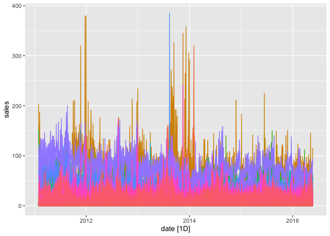

Preprocessing
================
Anh Tran
2022-12-12

``` r
knitr::opts_chunk$set(echo = TRUE)

library(fpp3)
```

    ## Registered S3 method overwritten by 'tsibble':
    ##   method               from 
    ##   as_tibble.grouped_df dplyr

    ## ── Attaching packages ──────────────────────────────────────────── fpp3 1.0.0 ──

    ## ✔ tibble      3.2.1     ✔ tsibble     1.1.5
    ## ✔ dplyr       1.1.4     ✔ tsibbledata 0.4.1
    ## ✔ tidyr       1.3.1     ✔ feasts      0.3.2
    ## ✔ lubridate   1.9.3     ✔ fable       0.3.4
    ## ✔ ggplot2     3.5.0     ✔ fabletools  0.4.2

    ## ── Conflicts ───────────────────────────────────────────────── fpp3_conflicts ──
    ## ✖ lubridate::date()    masks base::date()
    ## ✖ dplyr::filter()      masks stats::filter()
    ## ✖ tsibble::intersect() masks base::intersect()
    ## ✖ tsibble::interval()  masks lubridate::interval()
    ## ✖ dplyr::lag()         masks stats::lag()
    ## ✖ tsibble::setdiff()   masks base::setdiff()
    ## ✖ tsibble::union()     masks base::union()

``` r
library(ggplot2)
library(corrplot)
```

    ## corrplot 0.92 loaded

``` r
library(Rraven)
library(stringr)
```

``` r
data_calendar <- read.csv('calendar_afcs2022.csv')
data_prices <- read.csv('sell_prices_afcs2022.csv')
data_train <- read.csv('sales_train_validation_afcs2022.csv')
data_test <- read.csv('sales_test_validation_afcs2022.csv')
```

# Preprocessing

## Train data

``` r
# In train set: Change id to item_id to match other datasets
data_train <- data_train %>% 
  mutate(item_id = str_extract(id, "(FOODS_3_)\\d{3}"),
         .after = id) %>% 
  subset(select = -id)

# Pivot to get date column and sales per item per day
data_train <- data_train %>% 
  pivot_longer(cols = starts_with("d_"),
               names_to = "day",
               names_prefix = "d_",
               values_to = "sales")
```

``` r
# Merge with calendar to get week, then with prices to get price
data_calendar <- data_calendar %>% 
  mutate(day = 1:nrow(data_calendar), .before = date) # to match with day in data_train
data_train_merged <- merge(x = data_train, y = data_calendar, by = "day", all.x = TRUE) 
data_train_merged <- merge(x = data_train_merged, y = data_prices, 
                           by.x = c("item_id", "wm_yr_wk"), all.x = TRUE)

# Reorder columns
data_train_merged <- data_train_merged %>% 
  relocate(c("day", "date", "sales", "sell_price"), .before = wm_yr_wk)
```

## Test data

``` r
# In test set: Change id to item_id to match other datasets
data_test <- data_test %>% 
  mutate(item_id = str_extract(id, "(FOODS_3_)\\d{3}"),
         .after = id) %>% 
  subset(select = -id)

# Pivot to get date column and sales per item per day
data_test <- data_test %>% 
  pivot_longer(cols = starts_with("d_"),
               names_to = "day",
               names_prefix = "d_",
               values_to = "sales")
```

``` r
# Merge with calendar to get week, then with prices to get price
data_test_merged <- merge(x = data_test, y = data_calendar, by = "day", all.x = TRUE) 
data_test_merged <- merge(x = data_test_merged, y = data_prices, by.x = c("item_id", "wm_yr_wk"), all.x = TRUE)

# Reorder columns
data_test_merged <- data_test_merged %>% 
  relocate(c("day", "date", "sales", "sell_price"), .before = wm_yr_wk)
```

## Merge train and test set into 1 time series

``` r
data <- bind_rows("train" = data_train_merged, 
                  "test" = data_test_merged, 
                  .id = "datasets")

# Make data a time series
data$date <- as.Date(data$date, "%m/%d/%Y")
data <- data %>% as_tsibble(key = item_id, index = date)

# Test plot
data %>% autoplot(sales) + theme(legend.position="none")
```

<!-- -->

## Export

``` r
# Convert data to csv
# Code retrieved from https://robjhyndman.com/hyndsight/ts2csv/
ts2csv <- function(x) {
  fname <- paste0(deparse(substitute(x)), ".csv")
  readr::write_csv(tsibble::as_tsibble(x), fname)
}

# ts2csv(data)

# Doing the same for the separate train and test sets
data_train_merged$date <- as.Date(data_train_merged$date, "%m/%d/%Y")
data_train_merged <- data_train_merged %>% as_tsibble(key = item_id, index = date)

data_test_merged$date <- as.Date(data_test_merged$date, "%m/%d/%Y")
data_test_merged <- data_test_merged %>% as_tsibble(key = item_id, index = date)

# ts2csv(data_train_merged)
# ts2csv(data_test_merged)
```
